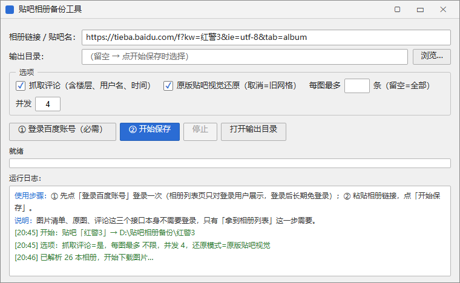
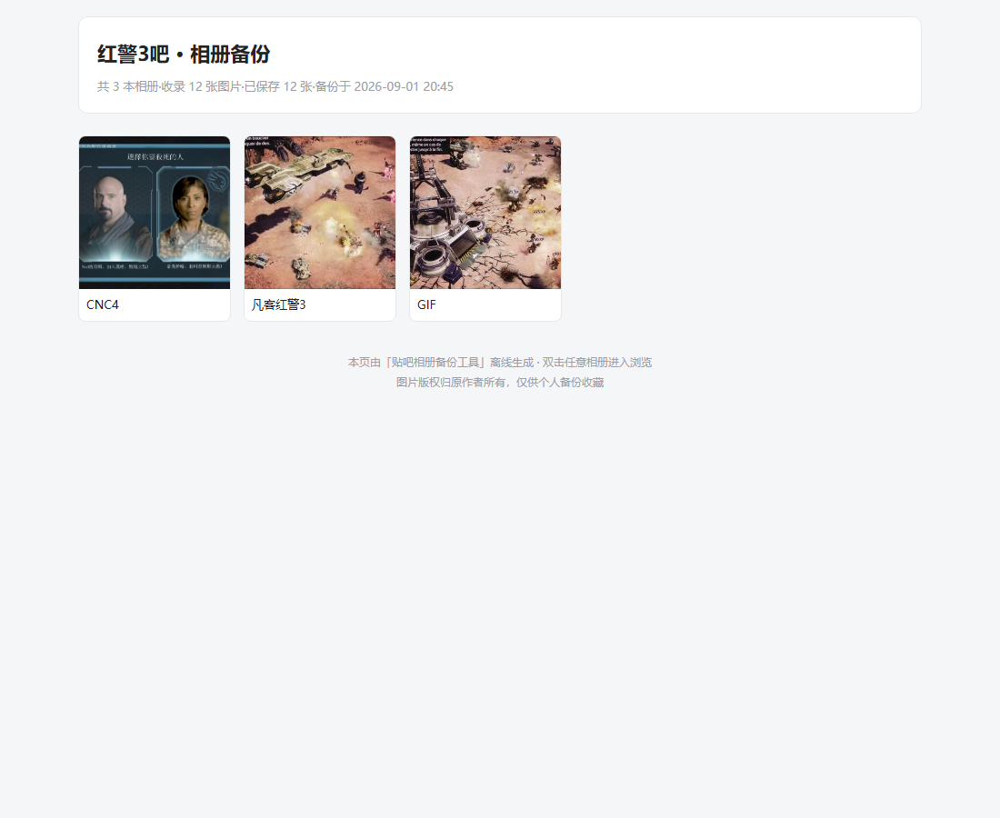
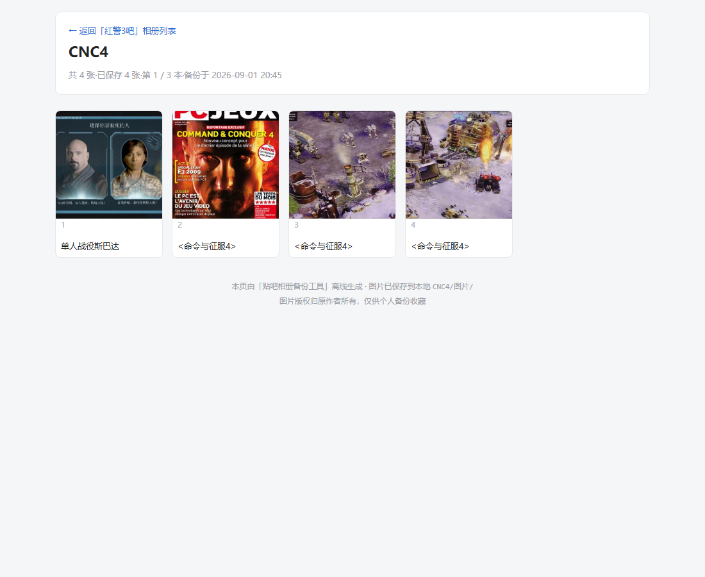
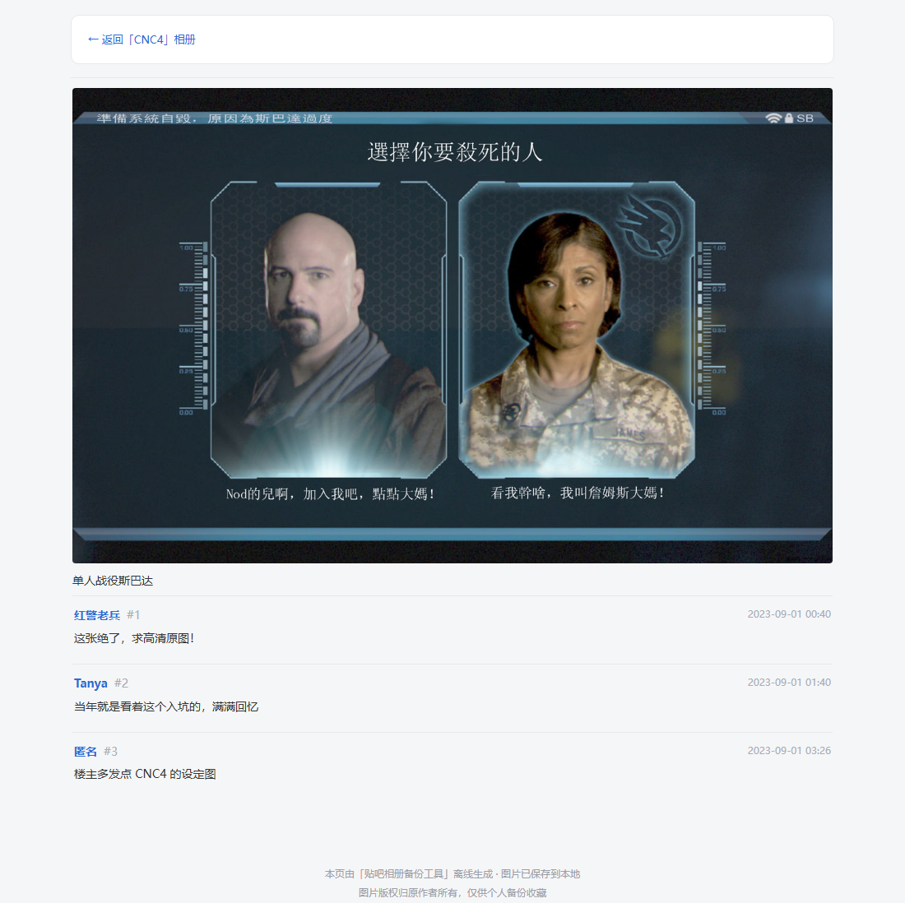

# 贴吧相册备份工具

> 一个 Windows 小工具，帮你在贴吧相册功能可能下线前，把某个贴吧的**全部相册、原图、评论**按原顺序保存到本地，并生成一套看起来和原网页差不多的离线 HTML。

图片版权归原作者所有，工具仅供个人备份收藏。

## 先看看效果

主界面长这样（下面是按实际控件绘制的预览）：



备份完成后，双击 `相册列表.html` 就能离线浏览，不需要联网：

**吧级相册墙（索引）** —— 点任意相册封面进入：



**单本相册墙** —— 点缩略图进入单张图的帖页：



**单图帖页** —— 大图 + 楼主描述 + 评论楼层：



## 直接下载用

不用装 Python，去 [Releases](https://github.com/tsingshitao-nuke/tieba-album-backup/releases) 下载：

| 版本 | 大小 | 说明 |
|---|---|---|
| `tieba-album-getter-playwright-v1.0.0.zip` | 约 143 MB | 内置浏览器驱动，最稳，双击即用 |
| `tieba-album-getter-slim-v1.0.0.zip` | 约 41 MB | 直连你本机已装的 Edge/Chrome，体积更小 |

解压后，**保持 exe 和 `_internal` 文件夹在同一目录**，不要单独把 exe 拖出来。第一次用需要联网登录一次百度账号，之后可以长期免登录。

## 怎么用

1. 打开 `贴吧相册备份工具.exe`。
2. 在「相册链接 / 贴吧名」填贴吧相册地址，例如：
   ```
   https://tieba.baidu.com/f?kw=红警3&ie=utf-8&tab=album
   ```
   或者直接填 `红警3` 也行。
3. 点 **① 登录百度账号** → 弹出浏览器，登录一次（贴吧的相册列表页只给登录用户看）。
4. 点 **② 开始保存** → 选择输出目录，建议放到 `D:	ieba_backup` 这类非系统盘。
5. 等待进度条跑完，点「打开输出目录」，从 `相册列表.html` 开始浏览。

> 输出目录每次都会弹框让你选，默认建议 `D:	ieba相册备份`，不会偷偷往 C 盘写。

## 备份出来是什么结构

一个典型的输出目录长这样：

```
红警3/
  相册列表.html                 # 吧级相册墙（入口页）
  相册列表_原始快照.html        # 原始 DOM 存档，排错用
  CNC4.html                     # 单本相册墙
  CNC4/
    图片/
      001_单人战役斯巴达.jpg
      002_命令与征服4.jpg
    帖子/
      001_单人战役斯巴达.html   # 大图 + 评论
      002_命令与征服4.html
  static/
    tieba_core.css              # 从现网贴吧抽取的真实 CSS（抽不到会回退到内置样式）
  manifest.json                 # 顺序/描述/路径/评论 元数据
```

图片按原顺序命名成 `序号_描述.扩展名`，比如 `001_单人战役斯巴达.jpg`。序号保证原顺序，描述保留原标题含义；没有描述时回退到贴吧的 `pic_id`。

## 关于「原版贴吧视觉还原」

打开「选项」里的「原版贴吧视觉还原」后，离线 HTML 会尽量贴近现网贴吧的排版（如上面的截图）。它靠两件事做到：

1. 用贴吧真实的 `class` 名和 DOM 结构。
2. 备份时从相册列表页自动抽取贴吧的真实 CSS（保存到 `static/tieba_core.css`）。

如果网络原因没抽到 CSS，也不用担心——每页都内嵌了一套精简的贴吧风 fallback 样式，页面不会裸奔。

取消勾选这个选项，会回退到旧版「单页网格」模式，兼容之前的输出。

## 几个需要知道的实测结论

- **贴吧全站用 GBK 编码**，不是 UTF-8，所以工具内部按 GBK 解析，否则中文会乱码。
- **贴吧不保存上传者的原始文件名**。接口里只有 `pic_id`（40 位哈希）和 `descr`（图片描述），所以文件名用 `序号_描述` 是最佳折中。
- **相册列表页必须登录 + 真实浏览器**。贴吧会拦截无头请求，所以工具才需要弹出一个真实浏览器窗口登录。
- **图片顺序**由接口返回的 `index` 字段保证，不是文件名顺序。
- **图片和评论接口本身不需要登录**，只有「拿到相册列表」这一步需要登录态。

## 常见问题

**Q：提示「未解析到相册 / 相册数为 0」怎么办？**  
几乎都是没登录。先点「① 登录百度账号」完成登录，再点「② 开始保存」。如果还 0 本，可以打开 `相册列表_原始快照.html` 看看页面结构。

**Q：卡在安全验证？**  
在弹出的浏览器窗口里手动完成滑块验证即可。

**Q：部分图片下载失败？**  
日志会标记失败项。下次重新运行会跳过已下载成功的图片（断点续传），不会重复下。

**Q：想只备份图片，不要评论？**  
取消勾选「抓取评论」，速度会快很多。

**Q：窗口程序崩溃看不到报错？**  
异常会写到 exe 旁边的 `启动错误.log`。命令行 `--selftest` 的结果会写到 `selftest_result.txt`。

## 自己编译 / 开发

```bat
:: 1) 装依赖
pip install playwright lxml pyinstaller
playwright install msedge      :: 或直接用系统 Edge

:: 2) 命令行试跑
python crawler.py --kw 红警3 --out-dir 输出
python crawler.py --kw 红警3 --out-dir 输出 --no-comments   :: 不抓评论
python crawler.py --login                                     :: 只打开登录窗口
python crawler.py --selftest                                  :: 本地自检
python app.py                                                 :: 启动 GUI

:: 3) 打包
python -m PyInstaller tieba_album_getter.spec           :: Playwright 版
python -m PyInstaller tieba_album_getter_slim.spec      :: 瘦身版
```

如果你是在某些带 `safe-delete` 沙箱的环境里打包，注意不要用 `rm -rf` 或 PyInstaller 的 `--clean`——会被拦截。正确做法是先把旧 `dist
ameuild
ame` 改个名移走，再重新打包。`build.bat` 已经按这个安全模式写好了。

## 协议

MIT License。详见 [LICENSE](LICENSE)。
